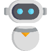

# All-In-Bot for Discord


A simple and modular Discord bot with various functionalities.

## How to use the bot?

Simple! Just invite the bot to your server using
this [link,](https://discord.com/api/oauth2/authorize?client_id=803637393143889980&permissions=274878154752&scope=bot)
and you are good to go!

## Development

I'm doing this project for fun. The bot is developed in a way, that each feature has their own module. New models can be
added by everyone. I'm happy about all contributions to this project. Especially about **feature ideas**!

### Arguments

```
optional arguments:
  -h, --help            show this help message and exit
  -e [EXCLUDE_FEATURES ...], --exclude-features [EXCLUDE_FEATURES ...]
                        Use this to exclude one or more features when starting the bot.
```

### Adding a feature

Just copy the [Template.py](features/Template.py) file and use it as a template for your feature. Be sure to give it a
unique name, and you're good to go.

#### Current Features implemented

- Fun (Just some Ping Pong)
- Math (Not nice, TODO: Replace with single command that detects and parses a regex)
- Memes (Crawls random meme from given subreddit. Default is dankmemes)
- R6Stats (Crawl stats für Rainbow Six: Siege using StatsDB API) --> Needs API username and key in .env file

#### Feature Ideas

- Translation from any language into another
- Improve help command
- ...

### Permissions

Currently, the bot uses the following permissions (Permission Integer: 274878154752):

- Send Messages
- Send Messages in Threads
- Embed Links
- Attach Files
- Read Message History
- Mention Everyone

If your feature needs further permissions, please contact me directly or open up an issue.

## Deployment

If you want to run the bot on your own server, you can do that as well. Remember to install
the [requirements](requirements.txt). Also, feel free to use the minimalistic [Dockerfile](Dockerfile)
and [docker-compose.yml](docker-compose.yml) files. Note that the docker files will assume your project's location in
your home directory. If you have trouble with Docker, don't ask me, I'm a noob myself xD

Additionally, you'll need to create a Discord developer account: https://discord.com/developers
The token needs to be added as TOKEN into a .env file, which you'll need to create yourself. I'm not gonna leak my stuff
here ;)

## TODO

- Setup logging
- Provide CLI options, e.g., to exclude features (DONE) and ...?


Logo: <dl><a href="https://www.flaticon.com/free-icons/robot" title="robot icons">Robot icons created by Freepik - Flaticon</a></dl>
